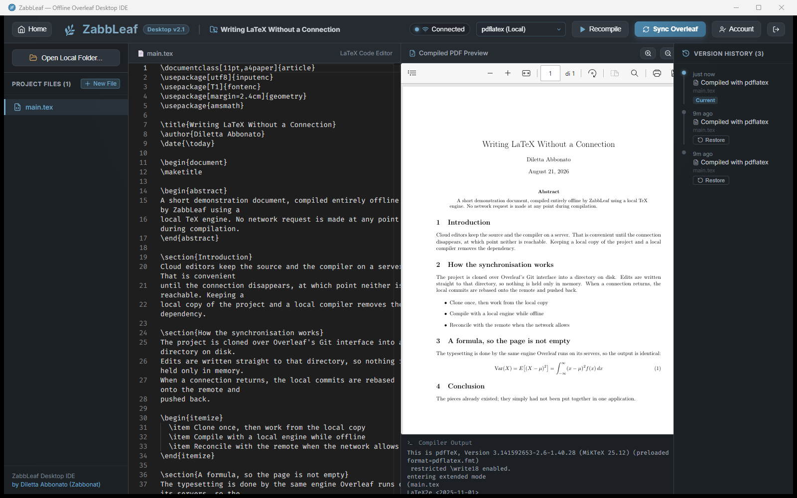
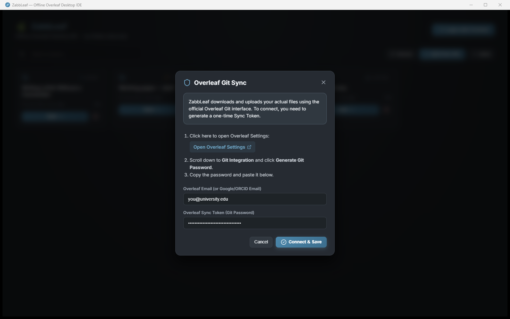
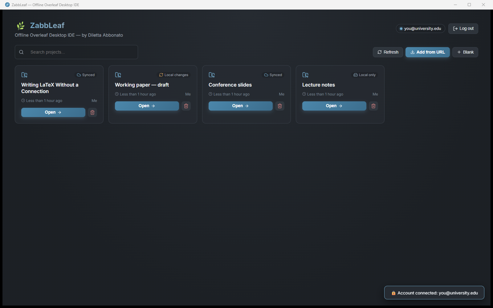
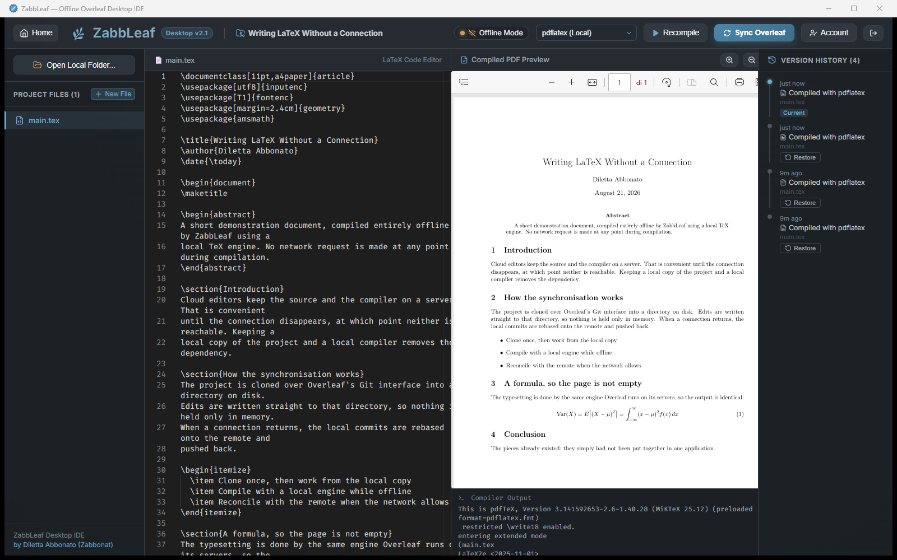

# ZabbLeaf

ZabbLeaf is a standalone desktop application for editing LaTeX offline and synchronizing with Overleaf.

Developed by Diletta Abbonato (Zabbonat).



Your Overleaf project, cloned to your machine, edited in a real editor, and compiled to PDF by a TeX engine running on your own computer.

- Runs as a native desktop program on Windows, macOS, and Linux.
- Clones and syncs Overleaf projects over Git, using a token from your Overleaf account.
- Compiles real PDFs offline with a local TeX engine — optional, see below.
- Keeps a local version history, so offline changes can be restored.
- Editing is powered by the Monaco editor.

---

## How it works

### 1. Connect your Overleaf account

ZabbLeaf reaches your projects through Overleaf's own Git interface, so it needs a Git token rather than your password. Generate one in Overleaf under **Account Settings → Git Integration**, then paste it here along with your email.



The token is stored locally and is only ever sent to `git.overleaf.com`. **Log out** removes it; projects you have already downloaded stay on your computer.

### 2. Add a project

Click **Add from URL** and paste an Overleaf project URL. ZabbLeaf clones it into `~/.zabbleaf/projects/<projectId>/` — a plain directory with a normal Git repository inside, which you can inspect or back up like any other folder.



Each card shows where that project stands: **Synced**, **Local changes** waiting to be pushed, or **Local only** for something created here and not yet linked to Overleaf.

### 3. Edit and compile, with or without a connection

Edits are written to disk as you type, not held in memory. Pick an engine and click **Recompile**:

| Engine | What it does | Needs internet |
| --- | --- | --- |
| **pdflatex / xelatex / lualatex** | Compiles on your machine, produces a real PDF | No |
| **Quick Text Preview** | Rough text rendering, no TeX required | No |
| **Push to Overleaf & open** | Pushes your changes, opens the project in your browser | Yes |



With the network gone the toolbar switches to **Offline Mode** — and a local engine still produces the PDF, because nothing leaves your computer to build it.

### 4. Sync back

**Sync Overleaf** commits your local changes, rebases onto whatever happened on Overleaf meanwhile, and pushes. Build files (`.aux`, `.log`, `.pdf`) are written outside the repository, so they are never pushed to your project.

A project you create with **Blank** exists only on your computer at first. Overleaf's Git interface cannot create projects, so to sync one you make an empty project on overleaf.com and let ZabbLeaf link the two — it offers to do this the first time you press **Sync Overleaf**.

---

## Download

No Node.js, terminal commands, or developer tools are required. Each release has **one file per system** — download the one that matches yours from [the latest release](https://github.com/zabbonat/ZabbLeaf/releases/latest):

| System | File |
| --- | --- |
| Windows | `ZabbLeaf_windows_installer.exe` |
| macOS | `ZabbLeaf_mac_installer.dmg` |
| Linux | `ZabbLeaf_linux_installer.AppImage` |

[View all releases](https://github.com/zabbonat/ZabbLeaf/releases)

ZabbLeaf needs `git` on the system. macOS ships a stub that prompts you to install the Xcode command line tools; if you would rather do it yourself, run `xcode-select --install`.

### First run on macOS and Linux

The releases are not code-signed, so both systems will stop you the first time. This is expected for an unsigned open-source build, not a sign that anything is wrong.

**macOS** — the first launch is refused with "ZabbLeaf can't be opened because the developer cannot be verified". Right-click the app in Applications and choose **Open**, then confirm. You only do this once. If macOS instead claims the app is *damaged*, clear the quarantine flag:

```bash
xattr -dr com.apple.quarantine /Applications/ZabbLeaf.app
```

**Linux** — make the AppImage executable before running it:

```bash
chmod +x ZabbLeaf_linux_installer.AppImage
```

---

## Do I need to install LaTeX?

**No — ZabbLeaf works without it.** Installing a TeX engine is an optional step, and you decide whether to take it. Choose whichever fits:

| What you want | What you need |
| --- | --- |
| Edit offline, sync with Overleaf | Nothing extra |
| A rough text preview of the document | Nothing extra (**Quick Text Preview**) |
| Let Overleaf produce the PDF | Nothing extra (**Push to Overleaf & open**) |
| Real PDFs, fully offline | A local TeX engine (~142 MB) |

### Installing a TeX engine

You are offered the choice **the first time you open ZabbLeaf**: if no engine is found, the home screen asks whether to install one. Say no and it will not ask again — the option stays available in the compiler menu.

The choice works the same way on all three downloads. It lives in the app rather than in the installer because a `.dmg` and an `.AppImage` have no installer screens of their own — and because it stays available later, if you change your mind after installing.

To do it yourself instead:

- **Windows** — run `scripts/install-latex.ps1`, or install [MiKTeX](https://miktex.org/download).
- **macOS** — `brew install --cask basictex`, or [BasicTeX](https://tug.org/mactex/morepackages.html).
- **Linux** — `sudo apt install texlive-latex-recommended texlive-fonts-recommended` (or your distribution's equivalent).

If you install MiKTeX by hand, two settings save trouble later. ZabbLeaf and the script apply them for you:

```powershell
initexmf --set-config-value "[MPM]AutoInstall=1"   # fetch missing packages without a dialog per package
mpm --install=cm-super                             # scalable fonts, needed by \usepackage[T1]{fontenc}
```

Without the first, a compile started from inside the app waits forever on a dialog nobody can see. Without the second, any document using `\usepackage[T1]{fontenc}` fails with *"auto expansion is only possible with scalable fonts"*.

---

## Where things are kept

| Path | Contents |
| --- | --- |
| `~/.zabbleaf/projects/<projectId>/` | The cloned project — a normal Git repository |
| `~/.zabbleaf/build/<projectId>/` | Compiler output, deliberately outside the repository |

---

## Building from source

Node.js (v18+) and Rust are required.

```bash
git clone https://github.com/zabbonat/ZabbLeaf.git
cd ZabbLeaf
npm install
npm run tauri build
```

The frontend must be built before anything touches Rust: `tauri::generate_context!()` reads `distDir` at compile time, and `dist/` is not in the repository. `npm run tauri build` handles this for you; running `cargo` on a fresh clone directly does not.

## License

MIT License. See LICENSE for details.
